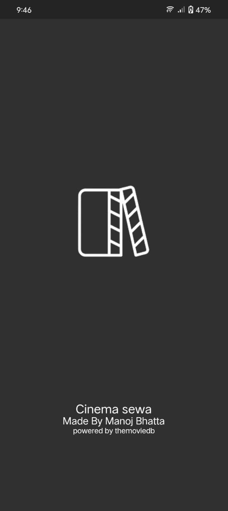
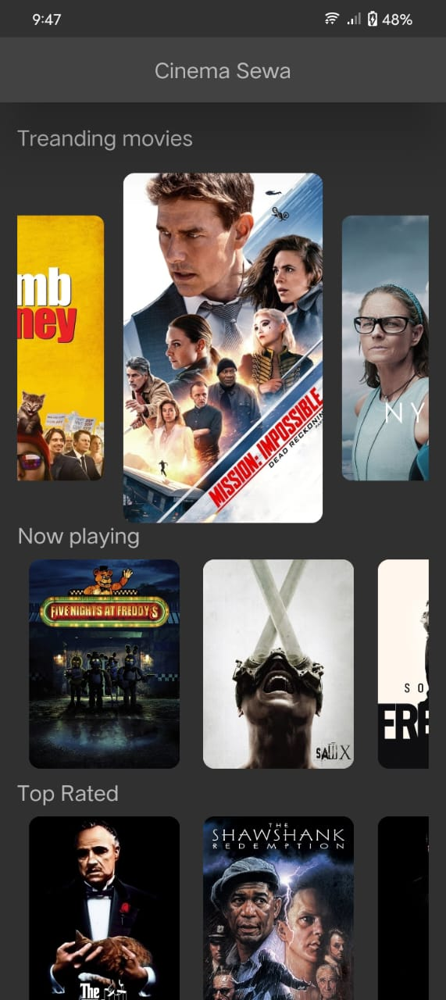
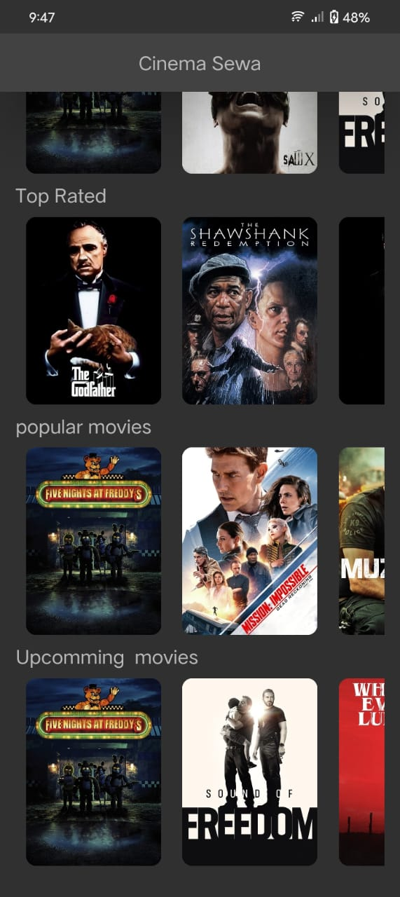
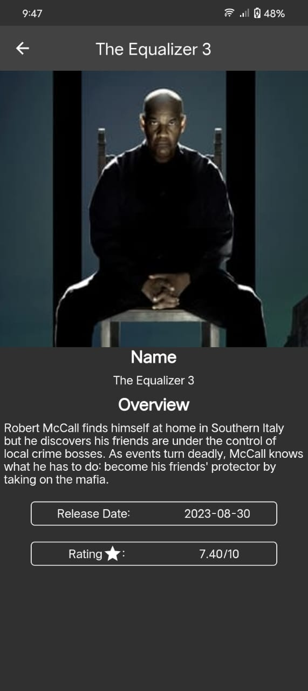

# Cinema Sewa

Cinema Sewa is your ultimate movie companion app, designed to deliver movie details efficiently with a focus on great animations. This README provides an overview of the app, its features, and how to use it.

## Features

- **Efficiency**: Cinema Sewa is built for speed and performance. Get movie information without delays.

- **Movie Details**: Dive deep into movies with comprehensive information, including cast, crew, and plots.

- **Overview**: Quickly grasp what a movie is about with concise and informative overviews.

- **Animations**: Enjoy stunning animations that enhance your interaction with the app, adding to the cinematic experience.

- **The Movie Database API**: Cinema Sewa is powered by The Movie Database (TMDb) API, ensuring access to a vast collection of movie data.

Cinema Sewa is powered by The Movie Database API - Your Gateway to the World of Movies! Enjoy the show. 🍿🎬

Here are the pictures of app:

